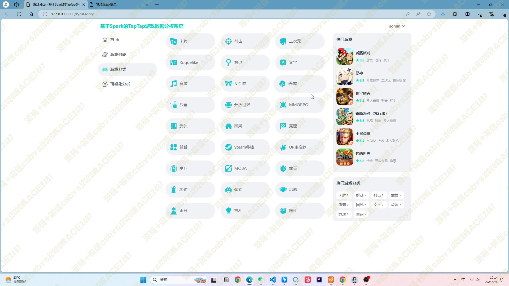
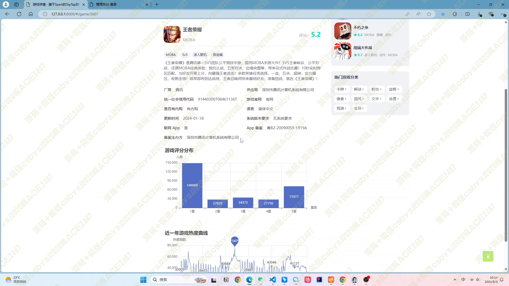
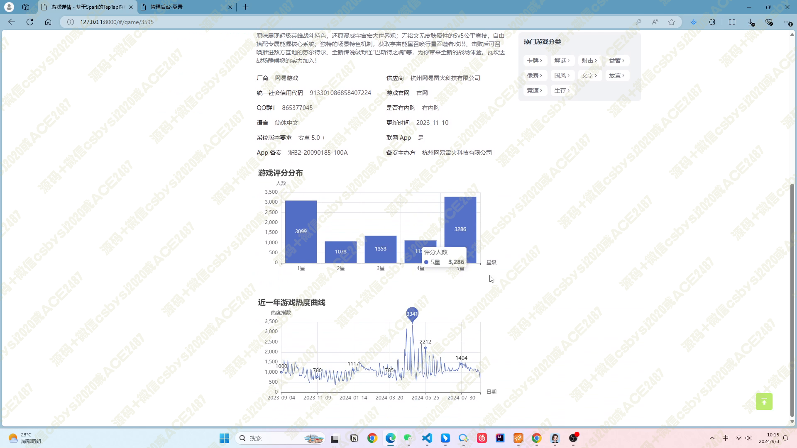
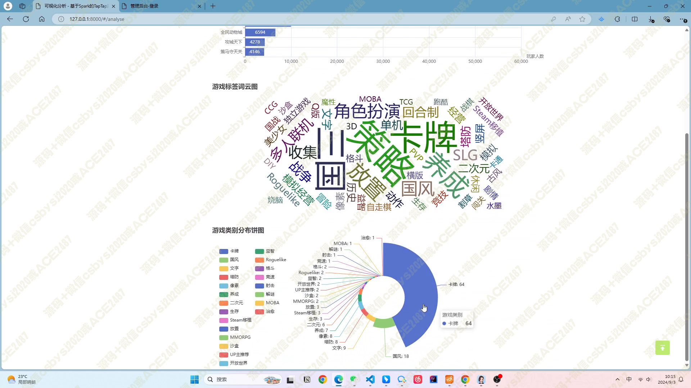
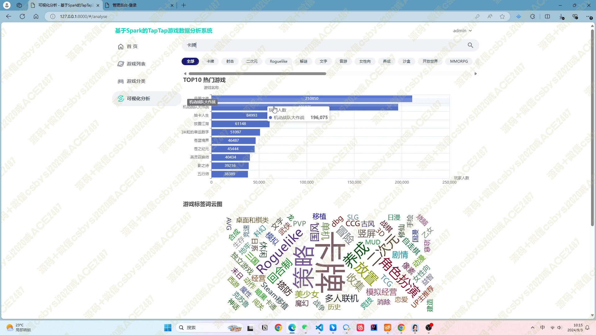
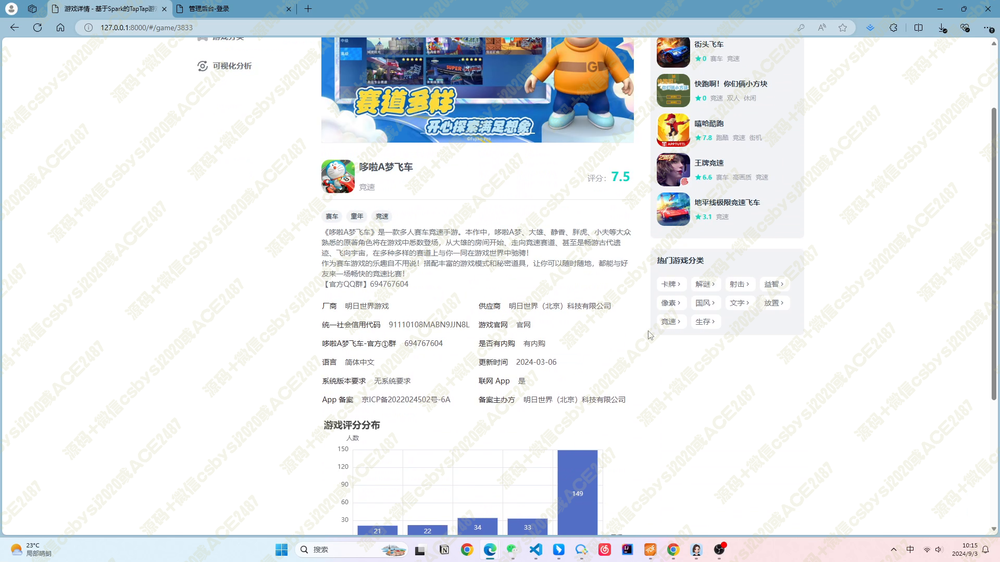
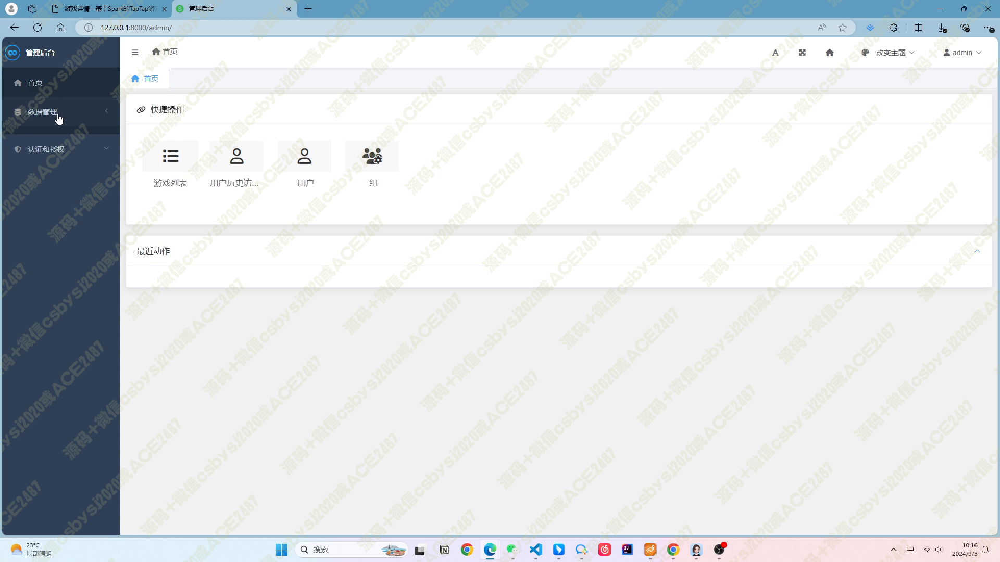
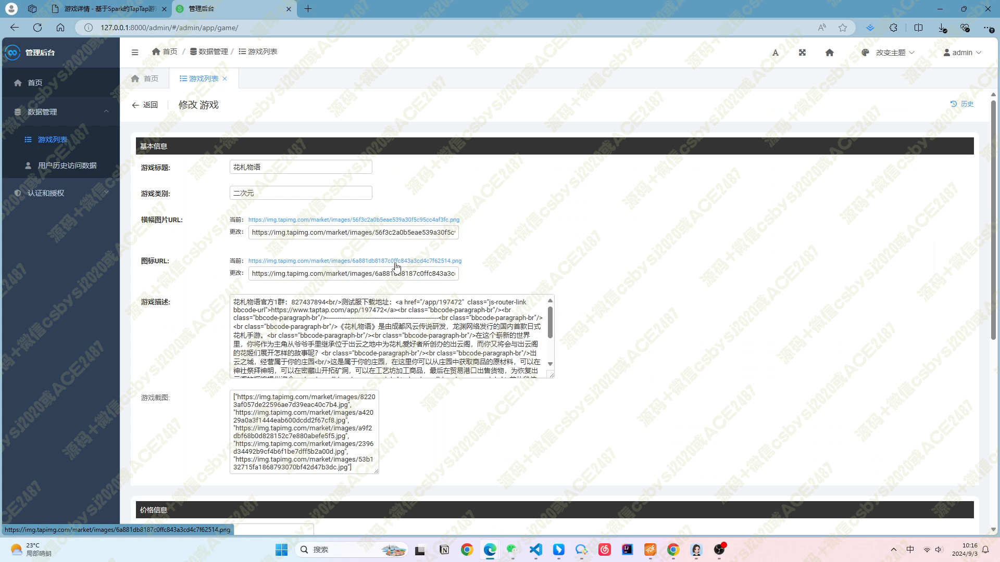
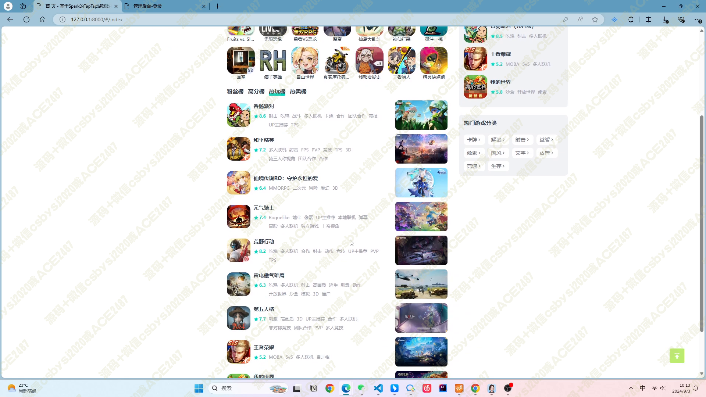

# 041 基于 Spark 的 TapTap 游戏数据分析系统-设计展示

> **代码有偿获取 可接受定制 微信联系方式: csbysj2020 或 ACE2487，备注(BS)**

> 

> 

## 介绍

基于 Spark 的 TapTap 游戏数据分析系统是一个综合性的数据分析平台，旨在为用户提供全面、深入的游戏数据洞察。该项目采用先进的技术栈，包括 Python、Django、Scrapy、Vue3、Spark、Element-Plus 和 ECharts，确保了系统的性能和用户体验。
系统的主要功能分为六个板块：

1. **爬虫模块**：利用 Scrapy 框架高效抓取 TapTap 游戏网站的数据，从分类页开始，全面覆盖全站游戏信息。
2. **首页**：设计精美的首页提供了丰富的内容。顶部 banner 轮播图展示热门游戏，用户推荐结果基于协同过滤算法，展示个性化游戏推荐。此外，还有游戏排名、热门游戏和游戏分类展示，满足不同用户的需求。
3. **游戏列表**：用户可以通过关键词搜索游戏，系统支持分页显示，方便用户浏览和查找。
4. **游戏分类**：提供多种游戏分类，如射击、二次元、Roguelike 等，用户可以轻松找到自己感兴趣的游戏类型。
5. **可视化分析**：系统支持对热门游戏、游戏类别分布和游戏标签进行可视化分析，通过柱状图、饼图和词云图等多种形式，帮助用户直观理解游戏市场趋势。
6. **游戏详情**：详细展示游戏的封面图、截图、基本信息如名称、分类、评分等，并提供了基于物品的协同过滤推荐结果。同时，通过柱状图和热度曲线走势图，展示了游戏的评分分布和热度变化。
7. **Django 管理后台**：方便管理员对用户和游戏列表进行管理，包括增删改查等操作。
   整个系统不仅具备高效的数据处理能力，还注重用户体验，通过精美的界面设计和实用的功能，为游戏爱好者提供了一个全面、便捷的游戏数据分析平台。

## 技术栈

该项目使用了以下技术栈：

1. **Python**：一种广泛使用的高级编程语言，适用于多种编程范式，因其简洁和易读性而受到欢迎。
2. **Django**：一个基于 Python 的高级 Web 框架，它鼓励快速开发和干净、实用的设计。
3. **Scrapy**：一个用于爬取网站和提取结构化数据的开源 Python 框架。
4. **Vue3**：一个用于构建用户界面的渐进式 JavaScript 框架，易于上手同时也能驱动复杂的单页应用。
5. **Spark**：一个用于大规模数据处理的快速、通用、可扩展的大数据计算引擎。
6. **Element-Plus**：一个基于 Vue 3.0 的桌面端组件库，提供了丰富的组件和功能，帮助开发者快速构建高质量的用户界面。
7. **ECharts**：一个使用 JavaScript 实现的开源可视化库，可以流畅地运行在 PC 和移动设备上，兼容当前绝大部分浏览器，提供了丰富的图表类型和个性化定制功能。

## 视频

> **点击查看 \>\>\> [https://www.bilibili.com/video/BV154HneaEZ4/](https://www.bilibili.com/video/BV154HneaEZ4/)**

## 截图

